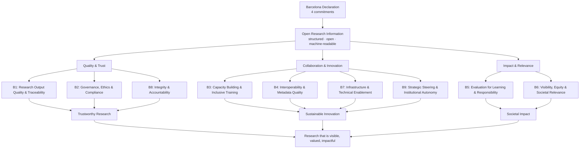

# The Nine Benefits of Open Research Information

Generated from `site/data/taxonomy.json` (brief v0.2) by
`scripts/generate-diagram.mjs`. Do not edit by hand; edit the JSON and regenerate.

Read top to bottom: the Declaration's commitments unlock ORI; ORI delivers the nine
benefit dimensions grouped in three axes; the benefits flow into three outcomes and,
together, into the vision. Definitions and who benefits from each dimension are in
`ORI_Benefits_Overview_brief.md`.
