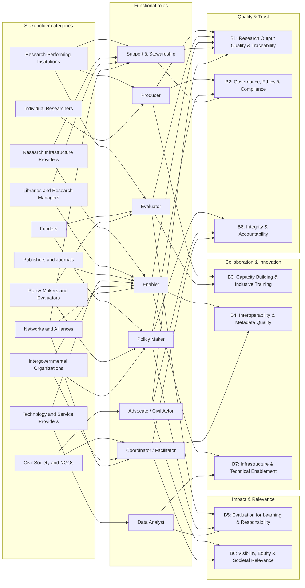

# Stakeholder and Benefits Map

Generated from `site/data/taxonomy.json` (taxonomy v1.0) by
`scripts/generate-diagram.mjs`. Do not edit by hand; edit the JSON and regenerate.

Edges read left to right: a stakeholder category acts through its typical functional
roles, and each role primarily delivers the benefit dimensions it points to. The full
per-stakeholder benefit list (including secondary mappings) is in section 5 of
`Taxonomy_ORI_Stakeholders_Benefits.md`.
